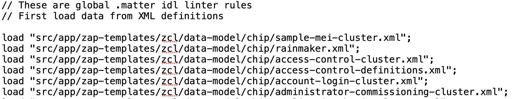
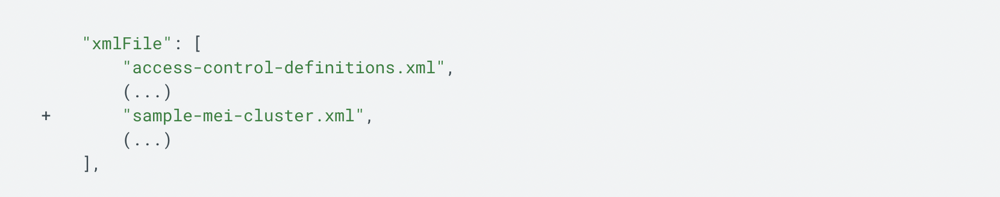
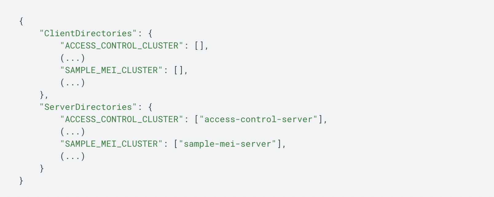

## Add Manufacturer Specific Cluster support in ESP RainMaker Android App

Assumption here is that you are already aware of the concept of clusters in matter terminology. For details you can refer to [here](
https://blog.espressif.com/matter-clusters-attributes-commands-82b8ec1640a0).

You can add support for your own custom cluster(s) in addition to the existing supported  clusters in your Android Application.
A few additional steps are required to add this support.

Adding your cluster support will require to generate jniLibs from ["connectedhomeip"](https://github.com/project-chip/connectedhomeip) repo and use those libs while building this app.
Here are the steps to compile.

### Setup Matter Repository

1. Check out the Matter repository. We have used SHA: 3c6bed3bb2 to generate matter libs.
```
$ git clone https://github.com/project-chip/connectedhomeip.git 
$ cd connectedhomeip 
$ git checkout 577b3f2be0e526643c124071de64f2e810982c87
$ git submodule update --init --recursive
```

2. Run bootstrap (**only required first time**)
```
$ source scripts/bootstrap.sh
```
Install required dependencies.

### Add your cluster definition

The first step to adding a custom feature is to define your data model in an XML file. In our sample, we've created the file  [`rainmaker.xml`](https://github.com/espressif/esp-matter/blob/main/components/esp_matter_rainmaker/rainmaker.xml).

In case you want to define your own new cluster, define your  `sample-mei-cluster.xml`  and place your data model file into this folder:  `src/app/zap-templates/zcl/data-model/chip`.

[Here](https://github.com/project-chip/connectedhomeip/blob/24b1d03460da8033490570a959995982af94c04d/src/app/zap-templates/zcl/data-model/chip/sample-mei-cluster.xml) is a sample XML file available in Matter repo.

### References to your cluster from other files

Some modifications will be required to add your cluster support.

1. Add `load "../src/app/zap-templates/zcl/data-model/chip/sample-mei-cluster.xml";` into scripts/rules.matterlint file.

   **`scripts/rules.matterlint`**

   

2. **`src/app/zap-templates/zcl/zcl.json`**  is also used by the ZAP GUI. It alternatively draws from this list the set of available clusters when a device is being created. Make sure you also define your cluster here.

   **`src/app/zap-templates/zcl/zcl.json`**

   

### Install ZAP for code generation

You will need the ZAP tool to edit the ZAP file to enable your new cluster in Android clients.

Run below command to download the latest version of ZAP tool.
```
$ ./scripts/tools/zap/zap_download.py
```

- [ZAP tool info](https://developers.home.google.com/matter/tools/zap)
- [ZAP tool repo](https://github.com/project-chip/zap)

Export the your ZAP installation path.
```
$ export ZAP_INSTALL_PATH=connectedhomeip/.zap/zap-v2025.01.10-nightly
```

### Add changes for zap code generation

Modify **`src/app/zap_cluster_list.json`** flags to the to include your server clusters and client clusters.
Add `"SAMPLE_MEI_CLUSTER": ["sample-mei-server"],` line to `“ServerDirectories”` and `"SAMPLE_MEI_CLUSTER": [],` line to `“ClientDirectories”` .

**`src/app/zap_cluster_list.json`**



### Add cluster to controller-clusters.zap

Note : DO NOT edit `src/controller/data_model/controller-clusters.zap` file manually.

- Run the below mentioned command to open the ZAP GUI.
```
$ ./scripts/tools/zap/run_zaptool.sh src/controller/data_model/controller-clusters.zap
```
- In the gui, select Endpoint-1 from the left pane.
- Find your cluster and turn on 'client/server'.
- Use the tab to select the Attributes page.
- Enable your attributes.
- Go back to the main page.
- Set the cluster to 'client'.
- Save the file.
- Close the GUI.

### Regenerate all code

Once all changes have been made, regenerate all code by running:
```
$ scripts/tools/zap_regen_all.py
```

### Build matter libraries

Now its time to build matter libraries after zap code regeneration gets successful.

You need Android SDK 26 & NDK 23.2.8568313 downloaded to your machine.
Set the `$ANDROID_HOME` environment variable to where the SDK is downloaded and the `$ANDROID_NDK_HOME` environment variable to point to where the NDK package is downloaded. The build also requires `kotlinc` to be in your `$PATH`.

Set environment variables :
```
export ANDROID_HOME=~/Library/Android/sdk
export ANDROID_NDK_HOME=~/Library/Android/sdk/ndk/23.2.8568313
export JAVA_HOME=/Applications/Android\ Studio.app/Contents/jbr/Contents/Home/
```

**ABIs and TARGET_CPU**
`TARGET_CPU` can have the following values, depending on your smartphone CPU architecture:

|      ABI    | TARGET_CPU |
|--|--|
| armeabi-v7a | arm |
| arm64-v8a | arm64 |
| x86 | x86 |
| x86_64 | x64 |


Now run below command to build :
```
./scripts/build/build_examples.py --target android-arm64-chip-tool build
```

Copy examples/android/CHIPTool/app/lib into your android project - “arm64-v8a” folder of jniLibs.

Rebuild the android project and run.

### Reference links

[Google docs for Matter cluster](https://developers.home.google.com/matter/extensions/sample-cluster)

[Matter repo](https://github.com/project-chip/connectedhomeip)

[Android Matter build steps](https://github.com/project-chip/connectedhomeip/blob/master/docs/platforms/android/android_building.md)

[Matter - Adding new clusters](https://github.com/project-chip/connectedhomeip/blob/master/docs/cluster_and_device_type_dev/how_to_add_new_dts_and_clusters.md)

[Espressif Matter blogs](https://blog.espressif.com/matter-38ccf1d60bcd)

[ESP Matter device setup](https://docs.espressif.com/projects/esp-matter/en/latest/esp32c3/developing.html#esp-matter-setup)
